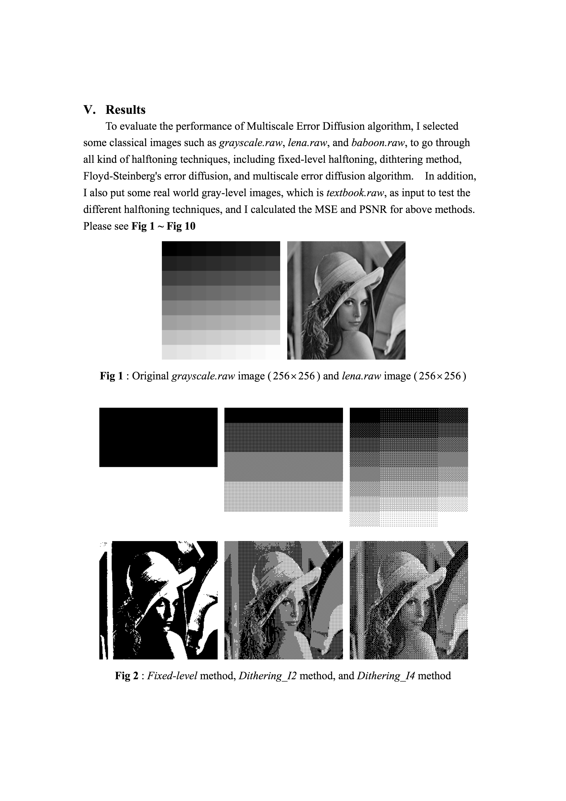
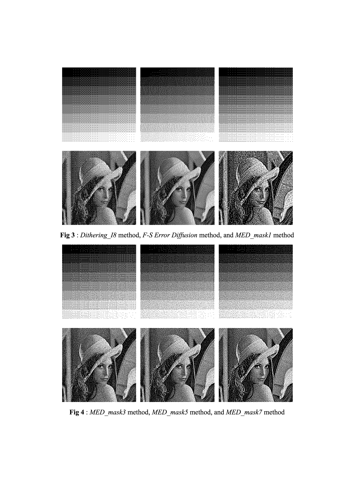
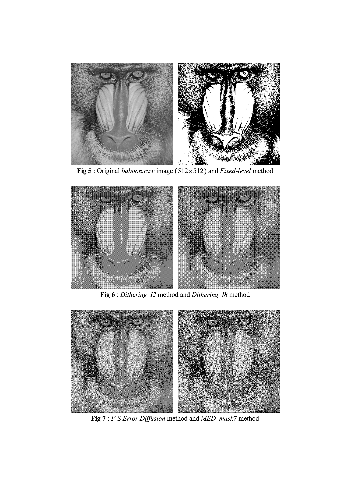
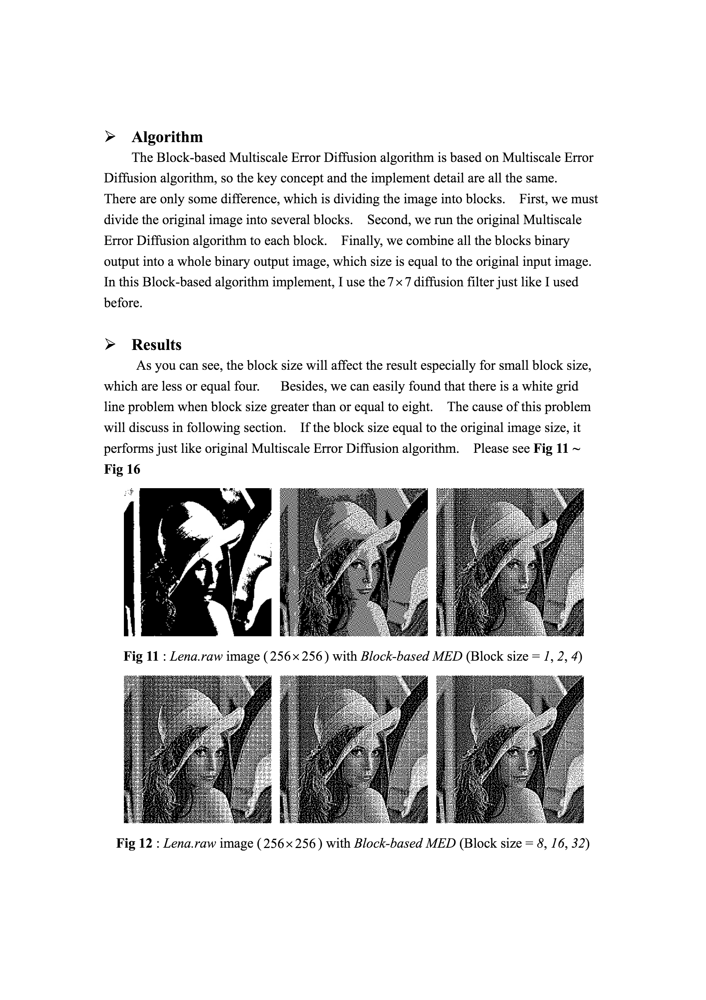
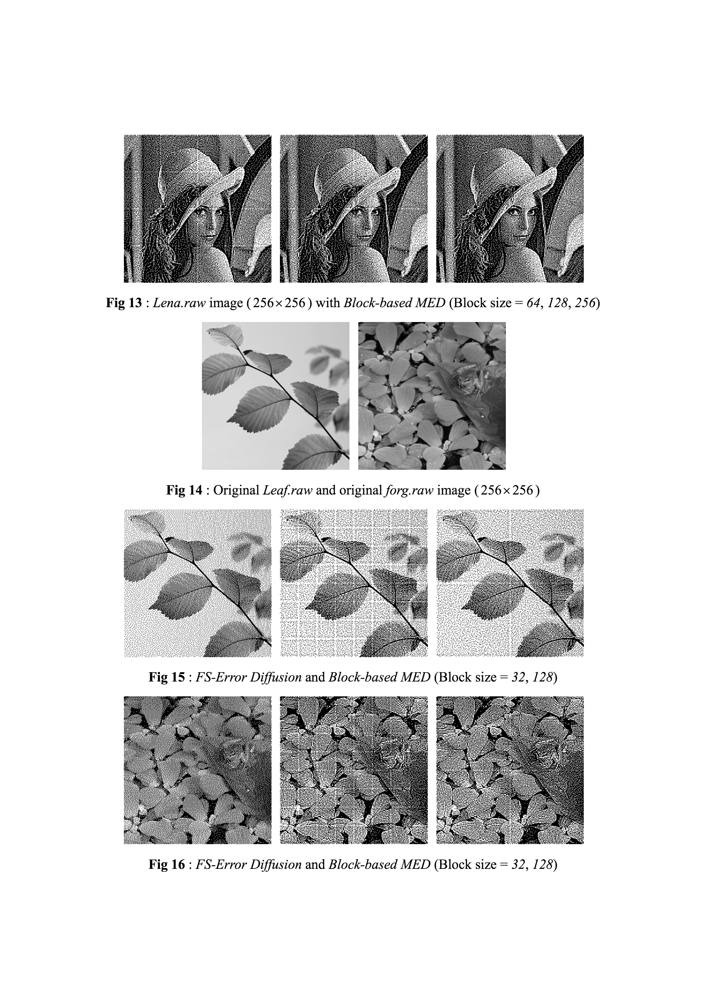
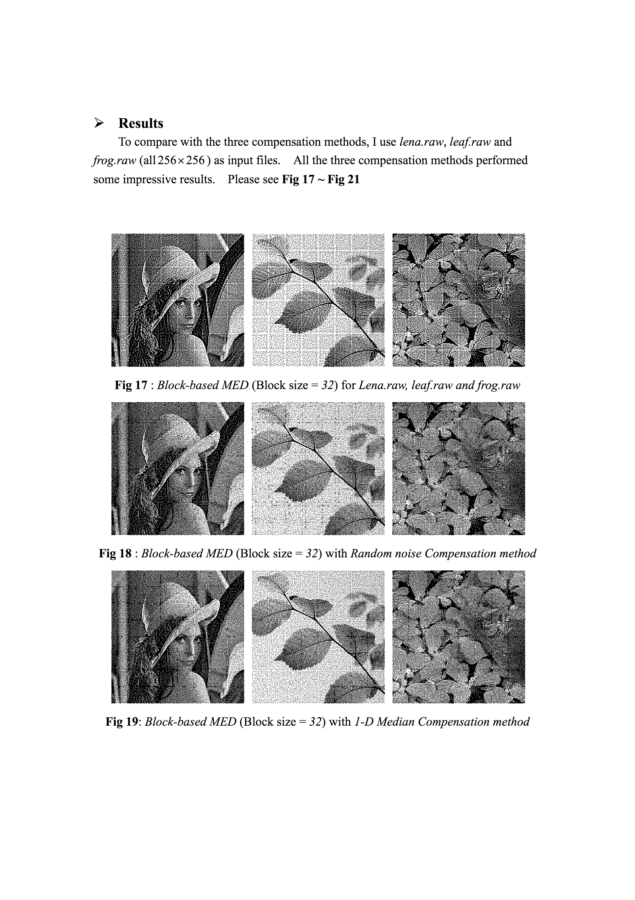
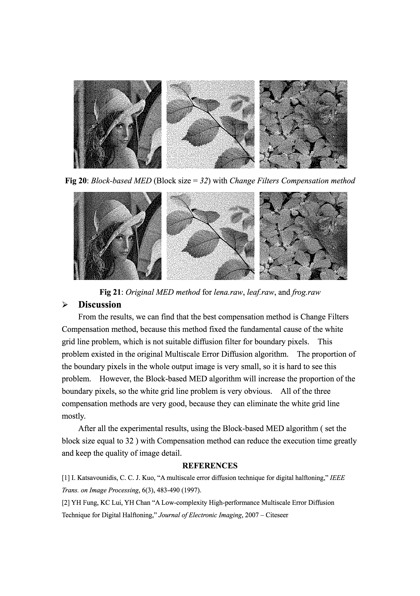

# usc-image-processing-project   

**USC Image Processing Term Project (2009):**  
  
**Summary**  
Improved MED runtime by 70%; implemented other algorithms: Direct Binarization, Dithering, and Error Diffusion  
  
Please see detail in [full pdf version](./Improved_the_Multiscale_Error_Diffusion_Technique_of_Digital_Halftoning.pdf).
  
**Selective Pages:**  
  
  
  
  
  
  
  
